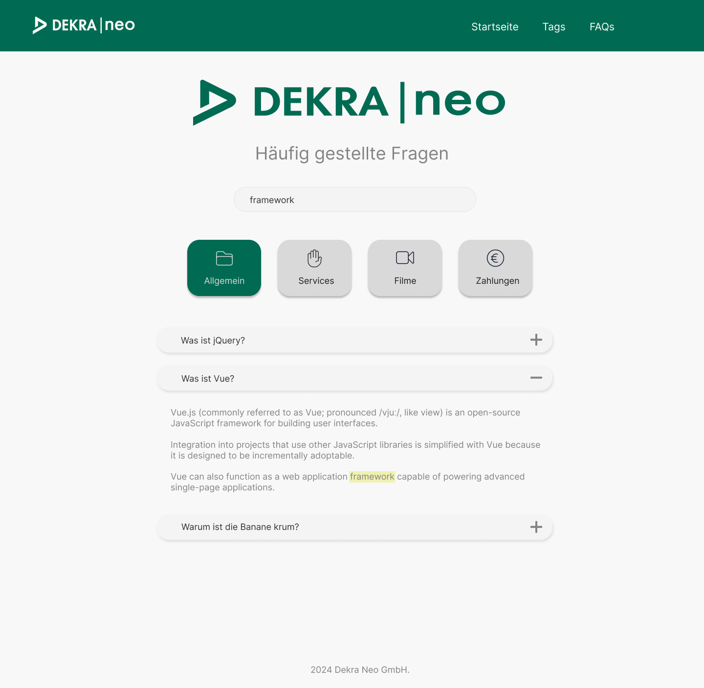
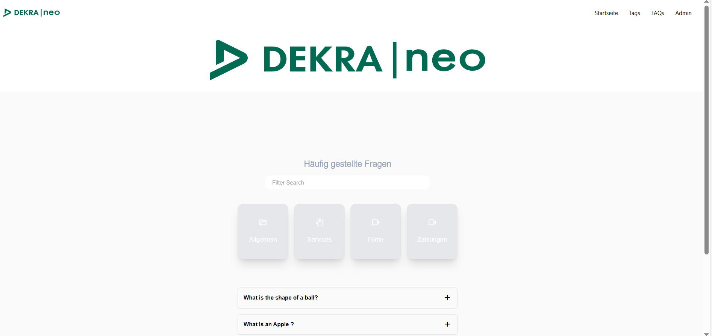

## About Laravel

Laravel is a web application framework with expressive, elegant syntax. We believe development must be an enjoyable and creative experience to be truly fulfilling. Laravel takes the pain out of development by easing common tasks used in many web projects, such as:

- [Simple, fast routing engine](https://laravel.com/docs/routing).
- [Powerful dependency injection container](https://laravel.com/docs/container).
- Multiple back-ends for [session](https://laravel.com/docs/session) and [cache](https://laravel.com/docs/cache) storage.
- Expressive, intuitive [database ORM](https://laravel.com/docs/eloquent).
- Database agnostic [schema migrations](https://laravel.com/docs/migrations).
- [Robust background job processing](https://laravel.com/docs/queues).
- [Real-time event broadcasting](https://laravel.com/docs/broadcasting).

Laravel is accessible, powerful, and provides tools required for large, robust applications.

## Learning Laravel

Laravel has the most extensive and thorough [documentation](https://laravel.com/docs) and video tutorial library of all modern web application frameworks, making it a breeze to get started with the framework.

You may also try the [Laravel Bootcamp](https://bootcamp.laravel.com), where you will be guided through building a modern Laravel application from scratch.

If you don't feel like reading, [Laracasts](https://laracasts.com) can help. Laracasts contains thousands of video tutorials on a range of topics including Laravel, modern PHP, unit testing, and JavaScript. Boost your skills by digging into our comprehensive video library.

## Laravel Sponsors

We would like to extend our thanks to the following sponsors for funding Laravel development. If you are interested in becoming a sponsor, please visit the [Laravel Partners program](https://partners.laravel.com).

### Premium Partners

- **[Vehikl](https://vehikl.com/)**
- **[Tighten Co.](https://tighten.co)**
- **[WebReinvent](https://webreinvent.com/)**
- **[Kirschbaum Development Group](https://kirschbaumdevelopment.com)**
- **[64 Robots](https://64robots.com)**
- **[Curotec](https://www.curotec.com/services/technologies/laravel/)**
- **[Cyber-Duck](https://cyber-duck.co.uk)**
- **[DevSquad](https://devsquad.com/hire-laravel-developers)**
- **[Jump24](https://jump24.co.uk)**
- **[Redberry](https://redberry.international/laravel/)**
- **[Active Logic](https://activelogic.com)**
- **[byte5](https://byte5.de)**
- **[OP.GG](https://op.gg)**

## Contributing

Thank you for considering contributing to the Laravel framework! The contribution guide can be found in the [Laravel documentation](https://laravel.com/docs/contributions).

## Code of Conduct

In order to ensure that the Laravel community is welcoming to all, please review and abide by the [Code of Conduct](https://laravel.com/docs/contributions#code-of-conduct).

## Security Vulnerabilities

If you discover a security vulnerability within Laravel, please send an e-mail to Taylor Otwell via [taylor@laravel.com](mailto:taylor@laravel.com). All security vulnerabilities will be promptly addressed.

## License

The Laravel framework is open-sourced software licensed under the [MIT license](https://opensource.org/licenses/MIT).

## Project requirement

Create an FAQ page using Laravel, MySQL, and Vue.js. The questions in the FAQ should come from a
database. A Laravel migration is required. The FAQs should be collapsible so that the answer is displayed
when clicked. Additionally, it should be possible to search for questions and/or answers in the search bar.
In addition to the above requirements, FAQs should be assignable to tags to organize the questions into
categories. There should be a view where a user with the "Admin" role can create, edit, and delete tags.
When creating or editing an FAQ, the admin should have the option to assign one or more tags to it, as
shown in the example image

## Addition Details

* Tag Management: A management view for tags that is only visible to admins. The admin can create
new tags, edit existing ones, or delete them.
* FAQ Management for Admins: A management view where an admin can create, edit, and delete
FAQs. Here, the question, answer, order, and associated tags can be managed.
* Access Control: The management of FAQs and tags should only be accessible to users with the
"Admin" role. These options should only be visible in the navbar when an admin is logged in.
* Two User Roles:
    * Admin: Can manage FAQs and tags and sees the corresponding management views in the
navbar.
    * Visitor: Can view and search the FAQ page but does not have access to the management
views.

## Expected Layout of app

  

## Actual Layout of app 

  

## Implementation tools

* PHP 8.3.4  
* Laravel 10.48.20  
* vue@3.4.38  

## Backend dependencies

* spatie/laravel-permission  * 6.9.0  

## Frontend dependencies

* vue-word-highlighter@1.2.4   
* vue-router@4.4.3  
* vue@3.4.38

## Starting project

sudo usermod -a -G www-data `whoami`  

Give the right permissions to /var/www  
sudo chown root:root /var/www   
sudo chmod 755 /var/www/  

Give these permissions to your project  
sudo chown -R www-data:www-data /var/www/<project>   
sudo chmod -R 774 /var/www/<project>  

php artisan key:generate  
php artisan migrate  
php artisan db:seed  

npm run dev  
php artisan serve  

## Login details

Admin: mike@example.com  
Pswd: password  

## Inspiration for Project 

https://medium.com/@prevailexcellent/role-and-permission-in-laravel-10-using-spatie-the-definitive-guide-2023-57bb6b56abcd
